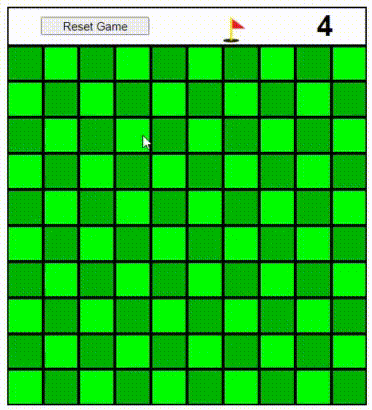

<p align="center">
  <h1>💣💣💣 Campo Minado 💣💣💣</h1>
  <h6>by <i>FranciscoCharles</i></h6>
</p>
<p align="justify">


Este projeto é apenas um exemplo para testar meus conhecimentos em **ReactJS** e **Node** de forma prática. Abaixo temos uma GIF mostrando o funcionamento do projeto.

</p>

<div align="center">
    
    <br>
    <h6>
        Figure 1 - exemplo de game play.
    </h6>  
</div>

# <a name=index>Indice📚</a>
- [**Controles**](#controles)
- [**Técnologias utilizadas no projeto**](#tecnologias)
- [**Como executar?**](#run)
- [**Dependências**](#dependencies)
- [**Versão**](#version)
- [**Licença**](#license)

# **<a name=controles>🕹️ Controles 🕹️</a>** <h6>[voltar ao indice](#index)</h6>

Os controles são simples, usa-se apenas o mouse para jogar:

 - Clique com o botão <kbd>esquerdo</kbd> do mouse(🖱️) para revelar o que tem no quadrado clicado.
 - Clique com o botão <kbd>direito</kbd> do mouse(🖱️) para por uma bandeira e marcar o quadrado. A banderia so pode ser colocada em quadrados não revelados, lembre-se que a quantidade de bandeiras são **limitadas**, use com cuidado.


# **<a name=tecnologias> 🧰 Técnologias utilizadas no projeto</a>** <h6>[voltar ao indice](#index)</h6>

 - **React**
 - **Styled-components**

# **<a name=run> ⚙️ Como executar? 🧠💭</a>** <h6>[voltar ao indice](#index)</h6>

 Faça o download do projeto, entre na pasta do projeto e digite o seguinte comando para instalar todas as dependências:
 ```bash
 npm install
 ```
 ou:
 ```bash
 npm i
 ```

 Para executar a aplicação use o comando:

```bash
npm start
 ```
# **<a name=dependencies>Dependências</a>**  <h6>[voltar ao indice](#index)</h6>

- [**Node**](https://nodejs.org/en/)

# **<a name=version>Versão</a>**  <h6>[voltar ao indice](#index)</h6>
- versão atual do projeto: 0.1.0.

# **<a name=license>Licença</a>**  <h6>[voltar ao indice](#index)</h6>

Para mais informações sobre a licença deste projeto, leia o arquivo <a href="./LICENSE" title="go to license file">LICENSE</a>.

---
<p align="center">
    Copyright © 2021 <b>FranciscoCharles</b>
</p>
